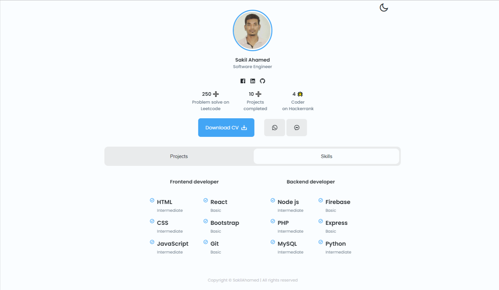

# 💼 Responsive Portfolio
### 💼 Responsive Portfolio

- Responsive mini portfolio website Using HTML CSS & JavaScript
- Contains animations css.
- Includes a light and dark mode.
- Developed first with the Mobile First methodology, then for desktop.
- Compatible with all mobile devices and with a beautiful and pleasant user interface.

<h3>Click here for live project - https://steady-entremet-05617a.netlify.app/</h3>

